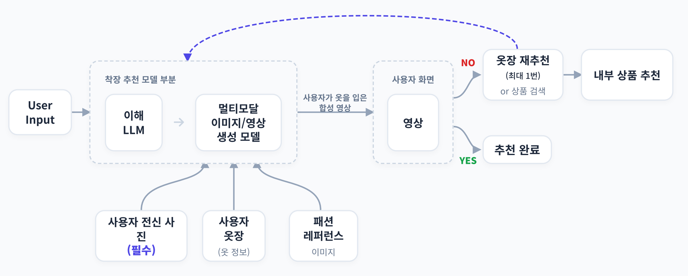

# 프로젝트 주제
CloZ(옷장을 부탁해)는 사용자의 입력 프롬프트를 기반으로 사용자의 옷장 정보에서 추천 착장을 추천해주는 서비스입니다.

<br>

### 서비스 플로우


1. User Input
비정형의 사용자 발화(e.g. "내일 홍대 갈건데 코디 추천해줘")에 대해 미리 선정해둔 정형화된 JSON 템플릿에 맞추어 모호한 발화를 더 명확하게 이해합니다.

2. 

<br>
<br>

---
---

# 기술적 및 서비스적 이슈 해결


<br>
<br>

---
---

# 프로젝트 아키텍쳐 및 기술 스택

### BE + FE 아키텍쳐


### AI 아키텍쳐


### 기술스택
<p>


</p>

<br>
<br>

---
---

# Python실행

<br>

### BE + AI 실행

1. 레포지토리 복제 & 서브모듈 업데이트
```bash
git clone <url>
git submodule update --remote --recursive
```

<br>

2. `.env`작성

`drf/.env` 작성        
`fastapi/.env` 작성      
`models/.env` 작성      

<br>

3. 도커 컨테이너 실행
```bash
docker compose exec app python manage.py migrate // 마이그레이션
docker compose down
docker compose build --no-cache // no-cache로 수행
docker compose up -d
docker compose ps
```

---

### FE 실행
```bash
npm run dev // 실행경로: cloz-fe/frontend
```
